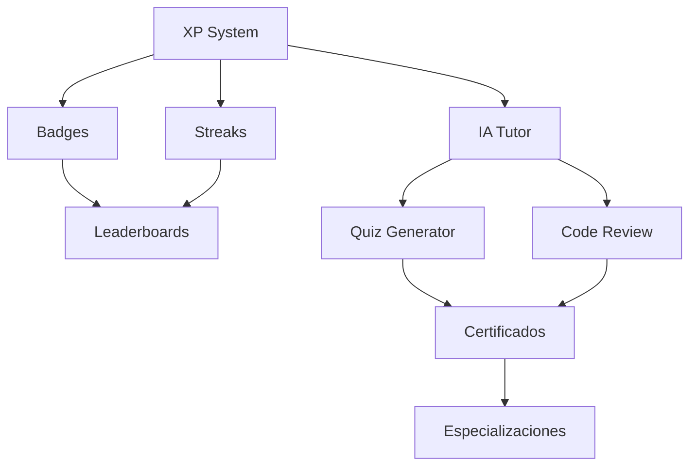

# 🗺️ ROADMAP - Plataforma Total Unificada

> **Visión:** Unificar FreeLLMAPI + Plataforma Total + Agent Orchestration en una plataforma educativa de próxima generación con IA nativa, multiagente y offline-first.

---

## 📅 Roadmap por Trimestres

### 🔴 **Q4 2026 (Oct-Dic) - Fundación + Gamificación Core**
| Feature | Descripción | Estado | Esfuerzo |
|---------|-------------|--------|----------|
| **Sistema XP/Niveles** | Puntos por lecciones, quizzes, proyectos | 🟡 En progreso | M |
| **Badges/Logros** | Badges por hitos, rachas, completados | ⏳ Pendiente | M |
| **Rachas Diarias** | Tracking visual, notificaciones | ⏳ Pendiente | S |
| **Leaderboards** | Globales, por curso, semanales | ⏳ Pendiente | M |
| **Sistema Recompensas** | Canjeables por contenido premium | ⏳ Pendiente | L |

### 🔴 **Q1 2027 (Ene-Mar) - IA Assistant + Certificaciones**
| Feature | Descripción | Estado | Esfuerzo |
|---------|-------------|--------|----------|
| **IA Tutor 24/7** | Chat contextual, explicaciones adaptativas | ⏳ Pendiente | L |
| **Quiz Generator IA** | Preguntas dinámicas por lección | ⏳ Pendiente | M |
| **Code Review IA** | Análisis automático + sugerencias | ⏳ Pendiente | L |
| **Certificados SHA-256** | Verificables, inmutables, blockchain-ready | ⏳ Pendiente | M |
| **Rutas de Especialización** | Full Stack, AI/ML, DevOps, Architect | ⏳ Pendiente | M |

### 🟡 **Q2 2027 (Abr-Jun) - Analytics + Integraciones**
| Feature | Descripción | Estado | Esfuerzo |
|---------|-------------|--------|----------|
| **Dashboard Ejecutivo** | Métricas tiempo real, cohortes | ⏳ Pendiente | L |
| **GitHub Integration** | Sync repos, PRs, issues desde app | ⏳ Pendiente | M |
| **Cloud Deploy (AWS/GCP/Azure)** | 1-click deploy con Terraform | ⏳ Pendiente | L |
| **IDE Plugins** | VS Code, JetBrains, Neovim | ⏳ Pendiente | M |
| **API Pública v1** | Documentación OpenAPI, SDKs | ⏳ Pendiente | M |

### 🟡 **Q3 2027 (Jul-Sep) - Multimedia + AR**
| Feature | Descripción | Estado | Esfuerzo |
|---------|-------------|--------|----------|
| **Video Interactivo** | Preguntas embebidas, capítulos | ⏳ Pendiente | L |
| **Code Sandbox Avanzado** | Multi-archivo, debug, tests | ⏳ Pendiente | L |
| **AR Tutorials** | Overlay código real-world | ⏳ Pendiente | XL |
| **Simuladores Infra** | K8s, Networks, DB visual | ⏳ Pendiente | L |

### 🟢 **Q4 2027 (Oct-Dic) - Expansión Global**
| Feature | Descripción | Estado | Esfuerzo |
|---------|-------------|--------|----------|
| **i18n Completo** | 15+ idiomas, RTL support | ⏳ Pendiente | L |
| **Multi-moneda/Pagos** | Stripe, Crypto, Regional | ⏳ Pendiente | M |
| **Compliance (GDPR/LGPD/CCPA)** | Tooling automático | ⏳ Pendiente | M |
| **Edge CDN Global** | <50ms latency worldwide | ⏳ Pendiente | M |

---

## 🏗️ Mejoras Técnicas Transversales

| Área | Items | Trimestre |
|------|-------|-----------|
| **Arquitectura** | Event-driven, CQRS, Message queues | Q4 2026 |
| **Performance** | Redis cache, Lazy loading, CDN | Q1 2027 |
| **Seguridad** | MFA, OAuth2, E2E encryption | Q1 2027 |
| **Testing** | 90% coverage, Load testing | Q2 2027 |
| **Observabilidad** | Distributed tracing, Alerting | Q2 2027 |

---

## 🎯 Priorización (MoSCoW)

| Prioridad | Features | Timeline |
|-----------|----------|----------|
| **Must Have** | XP, Badges, Streaks, IA Tutor, Certificados | Q4 2026 - Q1 2027 |
| **Should Have** | Leaderboards, GitHub Sync, Dashboard | Q1 - Q2 2027 |
| **Could Have** | AR Tutorials, Code Sandbox, Plugins | Q3 2027 |
| **Won't Have (Yet)** | Blockchain certs, Native mobile apps | 2028+ |

---

## 🔗 Dependencias Clave

---

## 📊 Métricas de Éxito (KPIs)

| Métrica | Target Q4 2026 | Target Q2 2027 |
|---------|----------------|----------------|
| **DAU/MAU Ratio** | > 40% | > 50% |
| **Completion Rate** | > 60% | > 75% |
| **Avg Session Time** | > 25 min | > 35 min |
| **Certificates Issued** | 1,000 | 10,000 |
| **IA Interactions/Day** | 5,000 | 50,000 |
| **NPS** | > 50 | > 70 |

---

## 🔄 Actualización

> **Última actualización:** 2026-09-20  
> **Próxima revisión:** Sprint planning cada 2 semanas  
> **Owner:** Team Plataforma Unificada  

---

> 💡 **Nota:** Este roadmap es vivo. Se actualiza en cada sprint review basado en feedback de usuarios, métricas y capacidad del equipo.