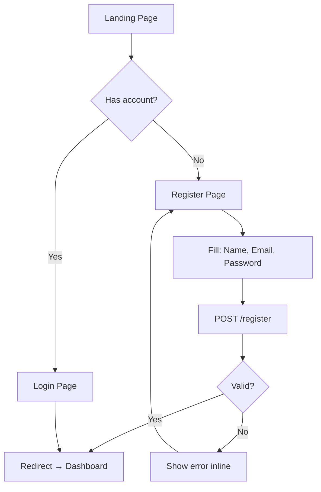
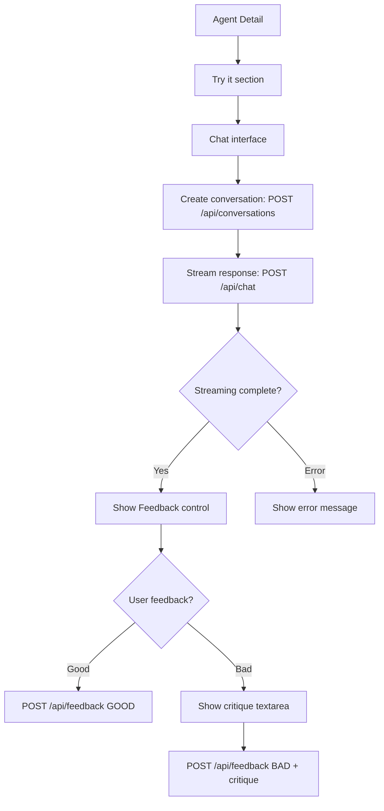
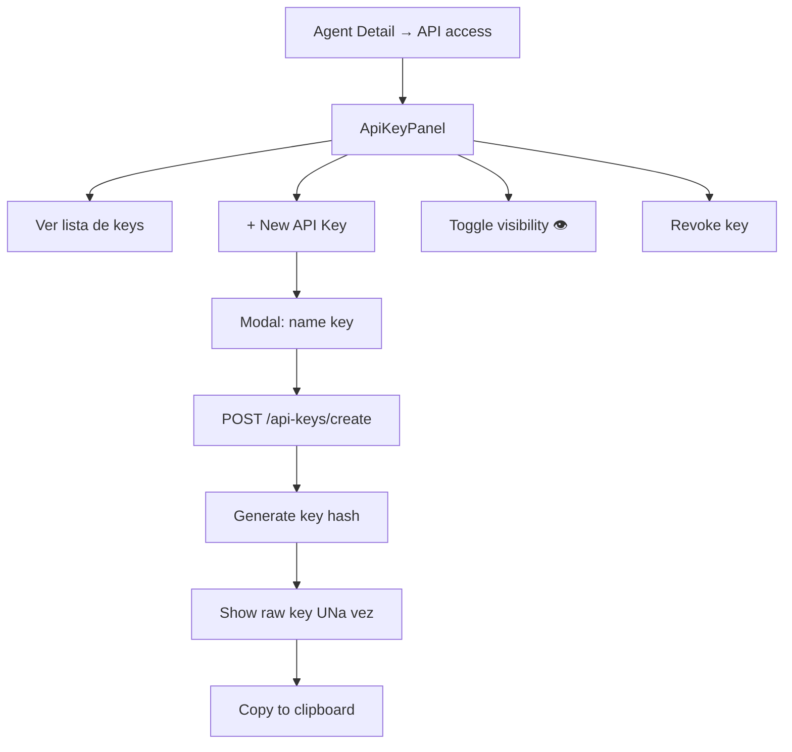

# UltraIa User Flows

## 1. Onboarding (New User)



**Puntos clave:**
- Register valida password min 8 chars
- Auto-login tras register (session httpOnly)
- Dashboard muestra CTA "Create your first agent" cuando no hay agents

---

## 2. Crear un Agente

```mermaid
flowchart TD
    A[Dashboard] --> B[+ New agent]
    B --> C[New Agent Page]
    C --> D[Fill: task description]
    D --> E[POST /agents/create]
    E --> F[Waiting: "Designing… ~15s"]
    F --> G{Agent created?}
    G -->|Yes| H[Redirect → /agents/[id]]
    G -->|No| I[Show error] --> C
```

**Backend (packages/core):**
1. `generateBlueprintDraft()` — LLM produce draft con systemPrompt, model, tools, rubric, guardrails, evalInputs
2. `createAgentBlueprint()` — transacción: crea blueprint + versión ACTIVE

**Loading state:** botón disabled + spinner "Designing your agent… (this can take ~15s)"

---

## 3. Probar / Chat con Agente



**Detalles:**
- Conversation creada on-demand (lazy)
- Streamming con Vercel AI SDK `useChat`
- Feedback aparece SOLO en último mensaje assistant
- Feedback se muestra: "Thanks — feedback recorded. This improves the agent."

---

## 4. Feedback & Improvement Loop

```mermaid
flowchart LR
    A[User: "Bad" + critique] --> B[POST /api/feedback]
    B --> C[Stored in Feedback table]
    C --> D[ImproveButton click]
    D --> E[POST /agents/[id]/actions]
    E --> F[generateImprovement]
    F --> G[LLM: review BAD feedback + failed evals]
    G --> H[Proposed new systemPrompt]
    H --> I[New AgentVersion PENDING]
    I --> J[Run regression evals]
    J --> K{New version pass?}
    K -->|Yes| L[Promote to ACTIVE, old → SUPERSEDED]
    K -->|No| M[Keep old ACTIVE, show regression error]
```

**States de versión:**
- `ACTIVE` — sirviendo tráfico, verde
- `PENDING` — propuesta, amarillo, botones [Approve] [Reject]
- `REJECTED` — rojo (puede volver a PENDING?)
- `SUPERSEDED` — gris (historial)

**UX: Approve versión PENDING**
- Muestra diff de systemPrompt
- Confirma: "This new version will replace the active one"
- Al aprobar → corro evals de regresión → si pasan, promueve

---

## 5. Evals (Evaluación de agente)

```mermaid
flowchart TD
    A[Agent Detail → Evaluations] --> B[EvalRunner]
    B --> C{Hay lastRun?}
    C -->|Yes| D[Show: avg score, pass rate, N cases]
    C -->|No| E["No evaluation runs yet."]
    A --> F[Test inputs (regression set)]
    F --> G[EvalInputForm: add input]
    A --> H[Run evals button]
    H --> I[POST /agents/[id]/evals]
    I --> J[Run each input → LLM-as-judge]
    J --> K[Store EvalRun + EvalCase results]
    K --> L[Update results table]
```

**LLM-as-judge:**
- Usa rubrica (3-6 criterios con weights)
- Score 0-1, verdict PASS if ≥ 0.6
- Regression tolerance: 0.05 (nueva versión no puede degradar más del 5%)

---

## 6. API Key Management



**Security:**
- `keyHash` (SHA-256) almacenado, raw key NO se guarda
- Key scope: agentes blueprint
- Rate limiting: implementado en API route layer

---

## 7. Navegación Global

```
Landing → Login/Register → Dashboard → Agent Detail
  ↓
Dashboard → + New Agent → New Agent Page → (create) → Agent Detail
  ↓
Agent Detail ↔ Chat ↔ Feedback
Agent Detail ↔ Evaluations
Agent Detail ↔ API Keys
Agent Detail ↔ Version History ↔ Approve/Reject
```

**Header persistente (auth routes):**
- Logo (volver a dashboard)
- "+ New agent" link
- Email del usuario
- Logout

**Desktop:**
- Sidebar no implementada en MVP — todo dentro del flow principal
- Breakpoints: 375 → 640 → 768 → 1024 → 1280+

---

## 8. Mobile Adaptations

| Component | Mobile | Tablet | Desktop |
|-----------|--------|--------|---------|
| Dashboard cards | 1 col | 2 cols | 3 cols |
| Agent Detail | flex col | grid col-5 | grid col-5 |
| Chat | full width | full width | 60% width |
| Feedback inline | botones Good/Bad full width | inline | inline |
| Version history | details open | details open | details open |
| Header nav | email truncado | full | full |

---

## 9. Estados de Error Comunes

| Escenario | Mensaje | UI |
|-----------|---------|-----|
| Task description vacía | "Task description is required" | Inline error en formulario |
| Task description > 4000 chars | "Task description is too long" | Inline error en formulario |
| LLM timeout | "Agent design timed out. Please try again." | Banner rojo + retry button |
| Error streaming chat | "Failed to start conversation" | Alert rojo sobre input |
| Feedback fail | "Failed to record feedback" | Toast |
| Eval fail | "Evaluation run failed. Check logs." | Banner amarillo |
| Version rejected | "Version rejected and archived." | Estado SUPERSEDED o REJECTED |
| Regression fail | "New version failed regression. Active version unchanged." | Modal de confirmación → rechazar automático |
