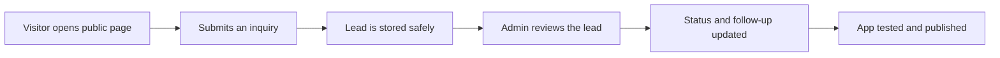

<h1 align="center">Vibe Coding with Base44</h1>

<p align="center">
  
</p>

<p align="center"><strong>The practical, zero-to-launch Base44 course I wish existed when I started.</strong><br>Learn by building a real app—not by reading a feature list.</p>

<p align="center">
  <a href="docs/00-start-here.md"></a>
  <a href="https://base44.pxf.io/c/6763812/2049275/25619?subId1=github&amp;trafcat=base"></a>
  <a href="https://github.com/cporter202/vibe-coding-with-base44/actions/workflows/docs-quality.yml"></a>
  <a href="LICENSE"></a>
</p>

<p align="center">
  <a href="docs/00-start-here.md"><strong>START HERE</strong></a> ·
  <a href="starter-kits/README.md"><strong>STARTER KITS</strong></a> ·
  <a href="docs/quick-reference.md"><strong>QUICK REFERENCE</strong></a> ·
  <a href="prompts/README.md"><strong>PROMPT LIBRARY</strong></a> ·
  <a href="docs/troubleshooting.md"><strong>GET UNSTUCK</strong></a>
</p>

## Find exactly what you need

| I want to...                          | Open this                                                             |
| ------------------------------------- | --------------------------------------------------------------------- |
| Build my first app from zero          | [15-minute Start Here lesson](docs/00-start-here.md)                  |
| Start from a complete project brief   | [Lead tracker, client portal, or booking kit](starter-kits/README.md) |
| Know which mode or workflow to use    | [One-page Base44 quick reference](docs/quick-reference.md)            |
| Copy a precise production prompt      | [20+ prompt library](prompts/README.md)                               |
| Understand an unfamiliar term         | [Plain-English glossary](docs/glossary.md)                            |
| Get a straight answer before starting | [Beginner FAQ with official sources](docs/faq.md)                     |
| Fix a problem without making it worse | [Symptom-based troubleshooting](docs/troubleshooting.md)              |
| Check security before sharing         | [Data, authentication, and security](docs/03-data-auth-security.md)   |
| Ship confidently                      | [Launch checklist](docs/06-launch-checklist.md)                       |

## Start in 60 seconds

1. Open the [15-minute Start Here lesson](docs/00-start-here.md).
2. Write one sentence describing your user and their problem.
3. Paste the provided planning prompt into Base44's **Plan mode**.
4. Follow the [lead-tracker build-along](docs/01-build-your-first-app.md).
5. Use the [launch checklist](docs/06-launch-checklist.md) before sharing your app.

<p align="center">
  <strong>No code, database experience, or technical vocabulary required.</strong><br><br>
  <a href="https://base44.pxf.io/c/6763812/2049275/25619?subId1=github&amp;trafcat=base"></a>
</p>

## Choose your path

| You are...               | Recommended path                                                                                                                                                                                                                                         |      Time |
| ------------------------ | -------------------------------------------------------------------------------------------------------------------------------------------------------------------------------------------------------------------------------------------------------- | --------: |
| Completely new           | [Start Here](docs/00-start-here.md) → [First App](docs/01-build-your-first-app.md) → [Prompts](docs/02-prompt-playbook.md) → [Security](docs/03-data-auth-security.md) → [Testing](docs/05-testing-debugging.md) → [Launch](docs/06-launch-checklist.md) | 2–3 hours |
| Ready to copy and build  | Pick a [complete starter kit](starter-kits/README.md), then use the [Quick Reference](docs/quick-reference.md) while building                                                                                                                            | 45–90 min |
| Already building         | [Prompt Playbook](docs/02-prompt-playbook.md) → [Testing](docs/05-testing-debugging.md) → [Troubleshooting](docs/troubleshooting.md)                                                                                                                     | 45–60 min |
| Adding advanced features | [Security](docs/03-data-auth-security.md) → [Integrations](docs/04-integrations-workflows.md) → [Developer Path](docs/07-developer-path.md)                                                                                                              | 60–90 min |
| Fixing one problem       | Go directly to [Troubleshooting](docs/troubleshooting.md) or the [Prompt Library](prompts/README.md)                                                                                                                                                     |  5–15 min |

<p align="center"><a href="docs/README.md"><strong>View the complete course map →</strong></a></p>

## What you will build

The guided project is a polished lead tracker for a small service business:



Along the way, you learn the same patterns used in client portals, booking tools, internal dashboards, directories, support systems, and lightweight SaaS products.

Want a different outcome? Open one of three complete build briefs:

| Starter kit                                        | Core lesson                                           |
| -------------------------------------------------- | ----------------------------------------------------- |
| [Lead Tracker](starter-kits/lead-tracker.md)       | Public submissions with private administration        |
| [Client Portal](starter-kits/client-portal.md)     | Sign-in, ownership, roles, and cross-user security    |
| [Booking Manager](starter-kits/booking-manager.md) | Request states, confirmation, and conflict prevention |

## The complete guide

|     # | Lesson                                                        | You will finish with                              |      Time |
| ----: | ------------------------------------------------------------- | ------------------------------------------------- | --------: |
|     1 | [Start Here](docs/00-start-here.md)                           | A clear, buildable version-one plan               |    15 min |
|     2 | [Build Your First App](docs/01-build-your-first-app.md)       | A working public form and private admin dashboard | 45–60 min |
|     3 | [Prompt Playbook](docs/02-prompt-playbook.md)                 | A repeatable system for precise changes           |    20 min |
|     4 | [Data, Auth & Security](docs/03-data-auth-security.md)        | A safe data model and permission matrix           |    25 min |
|     5 | [Integrations & Workflows](docs/04-integrations-workflows.md) | A plan for email, APIs, automations, and payments |    20 min |
|     6 | [Testing & Debugging](docs/05-testing-debugging.md)           | Role-based tests and a reliable debugging loop    |    20 min |
|     7 | [Launch Checklist](docs/06-launch-checklist.md)               | A responsibly tested release                      |    20 min |
| Bonus | [Developer Path](docs/07-developer-path.md)                   | A map for GitHub, local code, SDK, and CLI        |    20 min |

Also included:

- [20+ production-quality prompts](prompts/README.md)
- [Three complete starter kits](starter-kits/README.md) with prompts, data models, permissions, and tests
- [One-page Base44 quick reference](docs/quick-reference.md)
- [Plain-English Base44 glossary](docs/glossary.md)
- [Sourced beginner FAQ](docs/faq.md)
- [Fast troubleshooting guide](docs/troubleshooting.md)
- [Curated official resources](docs/resources.md)
- [Printable progress checklist](docs/course-checklist.md)

## Why this guide is different

- **Outcome-first:** every chapter tells you what you will accomplish and how long it should take.
- **Beginner-safe:** technical terms are translated into plain language.
- **Copy-ready:** prompts include scope, permissions, failure states, and acceptance criteria.
- **Project-ready:** starter kits include the plan, data model, permissions, build order, and tests.
- **Security-aware:** authentication is never confused with authorization.
- **Honest about limits:** plan requirements, beta features, and platform constraints are called out.
- **Maintained:** automated Markdown and link checks help catch quality regressions.
- **Independent:** commercial links are disclosed clearly and official documentation is linked for changing facts.

## The prompt pattern you will use

```text
On [PAGE], when [USER] does [ACTION], change [CURRENT BEHAVIOR] so that
[EXPECTED BEHAVIOR].

Keep [THINGS THAT MUST NOT CHANGE] unchanged.

Done means:
- [OBSERVABLE RESULT]
- [IMPORTANT FAILURE OR EDGE CASE]
- [WHAT MUST NEVER HAPPEN]
```

That small structure is the difference between “make it better” and a change you can review, test, and trust.

## Base44 in plain English

Base44 is an AI app builder. You describe what you want, and it can create the interface, data tables, authentication, logic, and hosted app.

The productive loop is: **Plan → Build small → Review → Test → Secure → Publish → Learn.** Keep the [Quick Reference](docs/quick-reference.md) beside you until that loop becomes automatic.

You remain the product owner. The AI can build quickly, but you decide who the app is for, what data it may expose, and what evidence proves it works.

## Current plan notes

Plans change, so verify details in [Base44's official billing documentation](https://docs.base44.com/Account-and-billing/Billing-and-plans) before purchasing. As of **July 27, 2026**:

- Free includes core building, authentication, database functionality, analytics, up to 5 apps, up to 25 monthly message credits with a current daily cap, and 100 monthly integration credits.
- Starter adds unlimited apps and in-app code edits.
- Builder is the first listed plan with backend functions, custom domains, GitHub integration, and manual model selection.
- New private apps require a paid plan.
- Plan and workspace changes are rolling out, so some accounts may differ.

Start free. Upgrade when a required capability—not impatience—justifies it.

## Safety before speed

Do not use a first project to store highly sensitive medical, financial, identity, children's, legal, or employment data. Never publish real API keys. Test every private workflow as two different users and an admin. Run Base44's security scan before launch.

Read [Data, Auth & Security](docs/03-data-auth-security.md) before collecting real user information.

## Contributing and support

- Found outdated information? [Report a documentation issue](https://github.com/cporter202/vibe-coding-with-base44/issues/new?template=documentation.yml).
- Built something useful? [Share it in the project showcase](https://github.com/cporter202/vibe-coding-with-base44/issues/new?template=showcase.yml).
- Have an improvement? Read [CONTRIBUTING.md](CONTRIBUTING.md).
- Need help with this guide? See [SUPPORT.md](SUPPORT.md).
- Need private account, billing, or platform help? Use [Base44 Support](https://docs.base44.com/Community-and-support/Contacting-support).

This is an independent community project—not official Base44 documentation and not affiliated with or endorsed by Base44 or Wix.

---

<p align="center">
  <strong>Ready to turn your idea into something real?</strong><br><br>
  <a href="https://base44.pxf.io/c/6763812/2049275/25619?subId1=github&amp;trafcat=base"></a><br><br>
  Then open <a href="docs/00-start-here.md">Start Here</a> or choose a <a href="starter-kits/README.md">complete starter kit</a>.<br><br>
  If this guide saves you hours, star the repository so the next beginner can find it.
</p>
